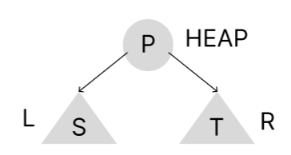
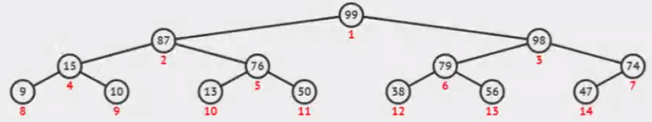
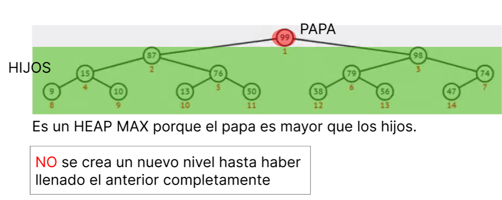
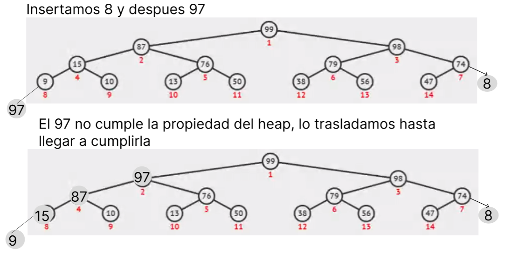
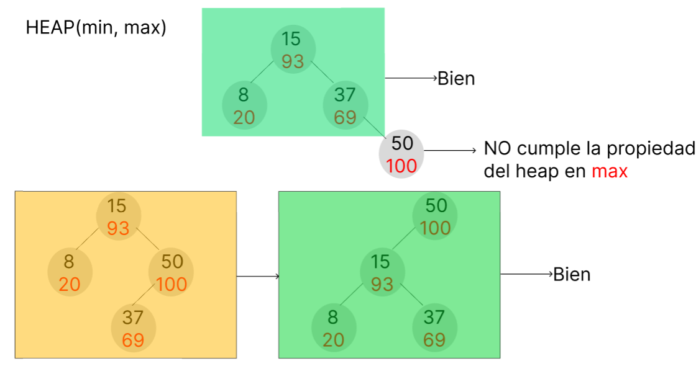

# treap-data-structure

## Introudcción:

Para comenzar tengamos en cuenta la estructura de un arbol binario (BST):

  <pre>
  
   
  En donde: BST(Vacio) = True
  BST(T) => x &isin; L : x < elemento
            x &isin; R : x > elemento
  En donde el BST se ve entre la union  de L ^ R.
  </pre>

Sin embargo si deseamos implementar un <b>treap</b> Debemos entender la estructura de un heap:

  <pre>
  
   
  En donde: heap(Vacio) = True
  heap(T) => p < s ^ p < t
  En donde el heap se ve entre la union  de L ^ R.
  </pre>

Teniendo eso en cuenta imaginemos el siguiente heap:

  

Sin embargo debemos a su vez mirar si éste heap es un <b> heap min </b> o es éste un <b> heap max </b> dependiendo de si su padre es mayor(heap min) o menor(heap max) que sus hijos:

  

  

## máxima cantidad de elementos y altura máxima de un heap

**Altura** = log₂(N + 1)

**Máxima cantidad de elementos** = 2ⁿ - 1

## Balanceo de los heap

  

## Reglas para un treap: X

1. inserto x  siguiendo la propiedad del bst

2. Genero un numero aleatorio en una distribucion probabilistica
      uniforme.

3. Revisamos que la propiedad del HEAP se cumpla y de lo contrario realizamos las rotaciones necesarias.

<pre style="color: orange">
Si la probalidad es uniforme entonces las rotaciones seran balanceadas y por consecuente el treap sera balanceado
</pre>

## Búsqueda

 **Complejidad de búsqueda** = O(ln(X))

 
